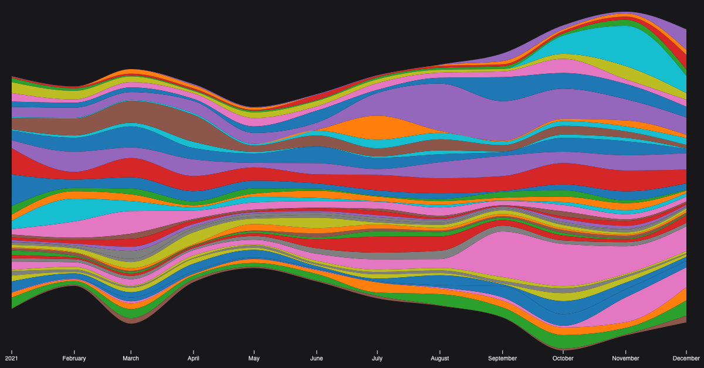

# Spotify Graph
> Graph out your listening history

Use your Spotify data to generate graphs detailing your listening history over the year.

[Try it out!](https://maximumfx.nl/spotify-graph/)

## Available settings

* **Graph Width**: `1920`
* **Graph Height**: `800`
* **Minimum listened ms (per song)**: `1000`
* **Minimum plays (per artist)**: `250`
* **Ignore Artists**: `''`
* **Group by**: `MONTH`
* **Start date**: _from data_
* **End date**: _from data_
